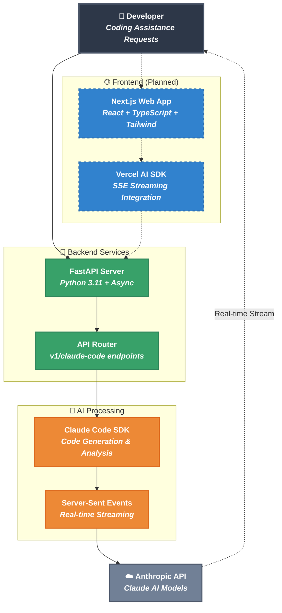

# Optima AI

A modern full-stack application built with FastAPI and Next.js, featuring real-time AI interactions with Claude Code SDK.

## 🏗️ Architecture

This is a monorepo containing:

- **Backend API** (`apps/api/`) - FastAPI application with Claude Code SDK streaming wrapper
- **Frontend Web** (`apps/web/`) - Next.js application (placeholder for future development)
- **Shared Packages** (`packages/`) - Common types and utilities
- **Documentation** (`docs/`) - Project documentation
- **Tools** (`tools/`) - Development and deployment scripts

### System Architecture



### Project Structure

```
optima-ai/
├── apps/
│   ├── web/                    # Next.js frontend (placeholder)
│   └── api/                    # FastAPI backend
│       ├── app/
│       │   ├── main.py        # FastAPI app entry point
│       │   ├── core/          # Configuration and settings
│       │   ├── api/           # API routes and endpoints
│       │   ├── models/        # Database models
│       │   ├── schemas/       # Pydantic schemas
│       │   ├── services/      # Business logic
│       │   └── utils/         # Utility functions
│       ├── tests/             # Test suite
│       └── pyproject.toml     # Poetry dependencies
├── packages/                   # Shared packages
├── tools/                     # Development tools
├── docs/                      # Documentation
└── docker-compose.yml        # Container orchestration
```

## 🚀 Quick Start

### Prerequisites

- **Node.js** 18+ and **pnpm** 8+
- **Python** 3.11+
- **Poetry** (for Python dependency management)
- **Docker** (optional, for containerized development)

### Installation

#### 1. Install Node.js (if not already installed)

**Option A: Using Node Version Manager (recommended)**

```bash
# Install nvm (on macOS/Linux)
curl -o- https://raw.githubusercontent.com/nvm-sh/nvm/v0.39.3/install.sh | bash

# Restart terminal or run:
source ~/.bashrc  # or ~/.zshrc

# Install and use Node.js 18+
nvm install 18
nvm use 18
```

**Option B: Direct installation**

- Visit [nodejs.org](https://nodejs.org/) and download Node.js 18+ LTS
- Or use package managers:

  ```bash
  # macOS with Homebrew
  brew install node

  # Ubuntu/Debian
  sudo apt update && sudo apt install nodejs npm

  # Windows with Chocolatey
  choco install nodejs
  ```

#### 2. Install pnpm (Package Manager)

**Option A: Using npm (if you have Node.js)**

```bash
npm install -g pnpm
```

**Option B: Using standalone installer (recommended)**

```bash
# On macOS/Linux
curl -fsSL https://get.pnpm.io/install.sh | sh -

# On Windows (PowerShell)
iwr https://get.pnpm.io/install.ps1 -useb | iex
```

**Option C: Using package managers**

```bash
# macOS with Homebrew
brew install pnpm

# Windows with Chocolatey
choco install pnpm

# Windows with Scoop
scoop install pnpm
```

**Verify pnpm installation:**

```bash
pnpm --version  # Should show 8.0.0 or higher
```

#### 3. Install Python 3.11+ (if not already installed)

**Option A: Using pyenv (recommended for version management)**

```bash
# Install pyenv (on macOS/Linux)
curl https://pyenv.run | bash

# Install Python 3.11
pyenv install 3.11.5
pyenv global 3.11.5
```

**Option B: Direct installation**

- Visit [python.org](https://python.org/) and download Python 3.11+
- Or use package managers:

  ```bash
  # macOS with Homebrew
  brew install python@3.11

  # Ubuntu/Debian
  sudo apt update && sudo apt install python3.11 python3.11-pip

  # Windows with Chocolatey
  choco install python311
  ```

#### 4. Install Poetry (Python dependency manager)

**Option A: Official installer (recommended)**

```bash
curl -sSL https://install.python-poetry.org | python3 -
```

**Option B: Using pip**

```bash
pip install poetry
```

**Option C: Using package managers**

```bash
# macOS with Homebrew
brew install poetry

# Windows with Chocolatey
choco install poetry
```

**Verify Poetry installation:**

```bash
poetry --version  # Should show 1.6.0 or higher
```

#### 5. Install Docker (Optional, for containerized development)

- Visit [docker.com](https://www.docker.com/get-started) and download Docker Desktop
- Or use package managers:

  ```bash
  # macOS with Homebrew
  brew install --cask docker

  # Ubuntu/Debian
  sudo apt update && sudo apt install docker.io docker-compose

  # Windows with Chocolatey
  choco install docker-desktop
  ```

### Development Setup

1. **Clone the repository**

   ```bash
   git clone <repository-url>
   cd optima-ai
   ```

2. **Verify installations**

   ```bash
   # Check all prerequisites
   node --version    # Should be 18+
   pnpm --version    # Should be 8+
   python --version  # Should be 3.11+
   poetry --version  # Should be 1.6+
   docker --version  # Optional
   ```

3. **Install dependencies**

   ```bash
   # Install Node.js dependencies for the monorepo
   pnpm install

   # Install Python dependencies for the API
   pnpm run install:api

   # Or install manually
   cd apps/api && poetry install && cd ../..
   ```

4. **Set up environment variables**

   ```bash
   # Copy environment template for API
   cd apps/api && cp .env.example .env

   # Edit apps/api/.env with your configuration
   # Add your Anthropic API key and other settings
   ```

5. **Start development servers**

   ```bash
   # Option A: Start both API and Web (when web is implemented)
   pnpm dev

   # Option B: Start individually
   pnpm dev:api    # FastAPI server on http://localhost:8000
   pnpm dev:web    # Next.js server on http://localhost:3000 (placeholder)

   # Option C: Using Docker
   pnpm docker:up  # Starts containerized services
   ```

6. **Verify setup**

   ```bash
   # Test API health endpoint
   curl http://localhost:8000/health

   # Visit API documentation
   # http://localhost:8000/docs
   ```

### API Development

```bash
cd apps/api

# Install Poetry dependencies
poetry install

# Activate virtual environment (optional, Poetry handles this)
poetry shell

# Run development server
poetry run python manage.py run --reload --host 0.0.0.0 --port 8000

# Or using uvicorn directly
poetry run uvicorn app.main:app --reload --host 0.0.0.0 --port 8000

# Run tests
poetry run pytest

# Run tests with coverage
poetry run pytest --cov=app --cov-report=term-missing

# Format code
poetry run black app/
poetry run isort app/

# Lint code
poetry run ruff check app/

# Type checking
poetry run mypy app/
```

## 📚 API Documentation

Once the API is running, visit:

- **Swagger UI**: http://localhost:8000/docs
- **ReDoc**: http://localhost:8000/redoc
- **OpenAPI JSON**: http://localhost:8000/api/v1/openapi.json

### Key Endpoints

- `GET /` - Welcome message with API information
- `GET /health` - Global health check
- `POST /api/v1/claude-code/code-assistance` - Stream coding assistance from Claude (SSE)
- `GET /api/v1/claude-code/health` - Claude service health check

### Example Usage

```bash
# Get coding assistance with streaming response
curl -X POST "http://localhost:8000/api/v1/claude-code/code-assistance" \
  -H "Content-Type: application/json" \
  -d '{
    "prompt": "Write a Python function for binary search with error handling",
    "context": "Working on a FastAPI project with algorithms",
    "session_id": "coding-session-001"
  }'

# Health check
curl http://localhost:8000/health

# Claude service specific health check
curl http://localhost:8000/api/v1/claude-code/health
```

## 🧪 Testing

```bash
# Run all tests
pnpm test

# Run API tests only
pnpm test:api

# Run tests with coverage
pnpm test:api:cov

# Run tests directly with Poetry
cd apps/api && poetry run pytest --cov=app
```

## 🎨 Code Quality

```bash
# Format and lint API code
pnpm lint:api

# Type check API code
pnpm type-check:api

# Run individual tools
cd apps/api
poetry run black app/          # Format code
poetry run isort app/          # Sort imports
poetry run ruff check app/     # Lint code
poetry run ruff check --fix app/  # Lint and auto-fix
poetry run mypy app/           # Type check
```

## 🐳 Docker Development

### Using Docker (Alternative Setup)

If you prefer containerized development, you can skip most manual installations and use Docker:

```bash
# Prerequisites: Only Docker and pnpm needed
# Install Docker Desktop and pnpm (see installation section above)

# Clone and setup
git clone <repository-url>
cd optima-ai
cd apps/api && cp .env.example .env  # Edit with your configuration

# Start all services with Docker
pnpm docker:up

# Other Docker commands
pnpm docker:build     # Build containers
pnpm docker:down      # Stop all services
pnpm docker:logs      # View logs from all services
pnpm docker:logs:api  # View API logs only
```

### Docker vs Local Development

| Aspect          | Local Development               | Docker Development             |
| --------------- | ------------------------------- | ------------------------------ |
| **Setup**       | Install Node.js, Python, Poetry | Install Docker only            |
| **Performance** | Faster (native)                 | Slightly slower                |
| **Debugging**   | Easier IDE integration          | Requires container debugging   |
| **Consistency** | May vary by OS                  | Consistent across environments |
| **Best for**    | Active development              | Testing, deployment simulation |

## 🎯 Features

### Current Features

- ✅ FastAPI backend with async support
- ✅ Claude Code SDK integration and wrapper
- ✅ Server-Sent Events (SSE) streaming for real-time responses
- ✅ Context-aware coding assistance
- ✅ Session management for related requests
- ✅ Proper project structure and configuration
- ✅ Comprehensive test suite
- ✅ Poetry dependency management
- ✅ Code formatting and linting tools
- ✅ Docker support
- ✅ API documentation with Swagger/ReDoc

### Planned Features

- 🔄 Next.js frontend with modern UI
- 🔄 Real-time chat interface for coding assistance
- 🔄 Advanced session management and history
- 🔄 User authentication and rate limiting
- 🔄 Database integration for session storage
- 🔄 Production deployment setup

## 🛠️ Technology Stack

### Backend

- **FastAPI** - Modern, fast web framework for Python
- **Claude Code SDK** - AI integration for code assistance
- **Pydantic** - Data validation using Python type annotations
- **Poetry** - Modern dependency management for Python
- **pytest** - Testing framework
- **uvicorn** - ASGI server

### Frontend

- **Next.js 15+** - React framework with App Router
- **TypeScript** - Type-safe JavaScript
- **Tailwind CSS** - Utility-first CSS framework
- **shadcn/ui** - Component library
- **Vitest** - Testing library

### Development

- **pnpm** - Fast, disk space efficient package manager
- **Turborepo** - Build system for monorepos
- **Poetry** - Python dependency management
- **Docker** - Containerization
- **Black** & **isort** - Code formatting
- **mypy** - Static type checking
- **Ruff** - Fast Python linter and code formatter

## 📖 Documentation

- [Project Structure](docs/project-structure.md)
- [API Development](docs/api-development.md)
- [Frontend Development](docs/frontend-development.md)
- [Deployment Guide](docs/deployment.md)
- [Contributing Guidelines](docs/contributing.md)

## 🤝 Contributing

1. Fork the repository
2. Create a feature branch (`git checkout -b feature/amazing-feature`)
3. Commit your changes (`git commit -m 'Add amazing feature'`)
4. Push to the branch (`git push origin feature/amazing-feature`)
5. Open a Pull Request

## 📝 License

This project is licensed under the MIT License - see the [LICENSE](LICENSE) file for details.

## 👥 Team

Built with ❤️ by the Optima AI Team

---

For more information, check out our [documentation](docs/) or open an issue.
